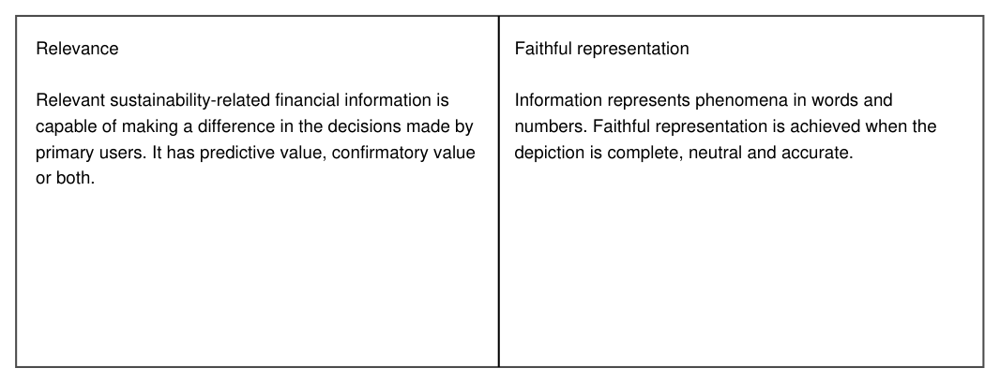
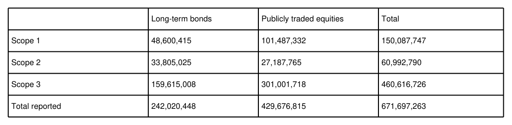

# Tableaux extraits de `test.pdf`

2 tableau(x) sur 1 page(s) traitee(s). Captures a 150 dpi dans `images/`.
### p. 1, tableau 1

| Relevance Relevant sustainability-related financial information is capable of making a difference in the decisions made by primary users. It has predictive value, confirmatory value or both. | Faithful representation Information represents phenomena in words and numbers. Faithful representation is achieved when the depiction is complete, neutral and accurate. |
| --- | --- |

> Capture de la zone d'origine. Si un chiffre est utilise, l'ouvrir et le relire dessus.

### p. 1, tableau 2

|  | Long-term bonds | Publicly traded equities | Total |
| --- | --- | --- | --- |
| Scope 1 | 48,600,415 | 101,487,332 | 150,087,747 |
| Scope 2 | 33,805,025 | 27,187,765 | 60,992,790 |
| Scope 3 | 159,615,008 | 301,001,718 | 460,616,726 |
| Total reported | 242,020,448 | 429,676,815 | 671,697,263 |

> Capture de la zone d'origine. Si un chiffre est utilise, l'ouvrir et le relire dessus.
